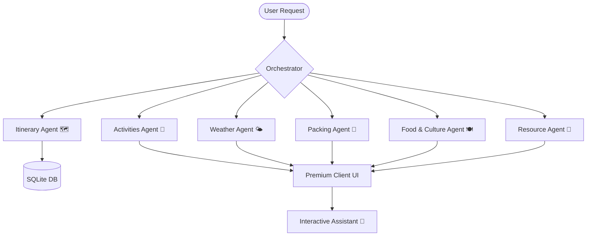

# AI Travel Itinerary Planner (Multi-Agent System)

Welcome to the **AI Travel Itinerary Planner**, a production-grade, modular multi-agent travel orchestration system. 

Originally conceived as a Streamlit application, the system has been evolved into a robust **decoupled client-server architecture**:
- **Modern Frontend**: Built with Next.js (React 19) and Tailwind CSS (v4) for a highly polished glassmorphic dark-mode user experience.
- **Asynchronous Backend API**: Powered by FastAPI, exposing modular API endpoints to control and orchestrate the multi-agent graph.
- **Multi-Agent Engine**: Orchestrated via LangGraph, LangChain, and local LLMs (Ollama) with fallback capabilities, integrating Google Serper for real-time web scraping.
- **Data Persistence**: Integrates SQLite for state tracking and database synchronization.

---

## 🗺️ System Architecture

The workflow leverages a sophisticated directed acyclic graph (DAG) structure using **LangGraph** where agents act as specialized state-updating nodes:



### Specialized Agents:
1. **Itinerary Agent (`generate_itinerary.py`)**: Drafts structured daily schedules (morning, afternoon, evening activities, and dining).
2. **Activities Agent (`recommend_activities.py`)**: Recommends unique, personalized local excursions and experiences.
3. **Weather Agent (`weather_forecaster.py`)**: Anticipates destination weather patterns and flags alerts.
4. **Packing Agent (`packing_list_generator.py`)**: Generates custom baggage check-lists tailored to local weather, trip length, and activities.
5. **Food & Culture Agent (`food_culture_recommender.py`)**: Provides traditional culinary suggestions, cultural etiquettes, and top local delicacies.
6. **Resource Agent (`fetch_useful_links.py`)**: Fetches highly rated web guides and booking resources using Serper API.
7. **Trip Assistant Chat Agent (`chat_agent.py`)**: Provides interactive, context-aware conversational support over the generated itineraries.

---

## 📁 Directory Structure

```text
MultiAgents-with-Langgraph-TravelItineraryPlanner-main/
│
├── backend/                  # FastAPI Backend Service
│   ├── agents/               # Modular AI Agent Implementations
│   │   ├── chat_agent.py
│   │   ├── fetch_useful_links.py
│   │   ├── food_culture_recommender.py
│   │   ├── generate_itinerary.py
│   │   ├── itinerary.py
│   │   ├── packing_list_generator.py
│   │   ├── recommend_activities.py
│   │   └── weather_forecaster.py
│   │
│   ├── core/                 # Core Initializations (LLM configuration, Auth)
│   │   ├── auth.py
│   │   └── llm.py
│   │
│   ├── models/               # SQLAlchemy Database Schemas & Initializations
│   │   └── database.py
│   │
│   ├── schemas/              # Pydantic Schemas for Request & Response
│   │   └── travel.py
│   │
│   ├── main.py               # Backend Server Entry point (FastAPI)
│   └── orchestrator.py       # LangGraph Orchestration & Workflows
│
├── frontend/                 # Next.js Client Interface
│   ├── src/
│   │   └── app/              # App Router Pages & Styles
│   │       ├── globals.css   # Tailored Custom Scrollbars & Tailwind rules
│   │       ├── layout.tsx    # Layout Wrapper
│   │       └── page.tsx      # Main Glassmorphic Dashboard UI
│   │
│   ├── package.json          # Node Dependencies & Scripts
│   ├── tsconfig.json         # TypeScript Configuration
│   └── next.config.ts        # Next.js Specific Configuration
│
├── agents/                   # Streamlit Legacy / Standalone Agent Folder
├── travel_agent.py           # Streamlit Legacy / Standalone Main Executable
├── requirements.txt          # Shared Python dependencies
├── .env                      # Global environment credentials (ignored)
├── travel_app.db             # Local development SQLite Database (ignored)
└── README.md                 # Project documentation
```

---

## 🚀 Setup & Installation

### Prerequisites
- **Python**: version `3.10+` recommended.
- **NodeJS**: version `18+` recommended (for Next.js frontend).
- **Ollama**: running locally with your chosen model (e.g., `llama3.2` or `llama3`).
  ```bash
  ollama pull llama3.2
  ```
- **Serper API Key**: Get a free search scraping credential at [serper.dev](https://serper.dev/).

---

### Step 1: Environment Configuration
Create a `.env` file in the root workspace directory:
```env
SERPER_API_KEY=your_google_serper_api_key
OPENAI_API_KEY=your_openai_api_key (if using OpenAI models in llm.py)
DATABASE_URL=sqlite:///./travel_app.db
```

### Step 2: Install Python Dependencies
```bash
pip install -r requirements.txt
```

### Step 3: Start the Backend API
Run the FastAPI development server:
```bash
python -m backend.main
# or
uvicorn backend.main:app --reload --port 8000
```
*The interactive Swagger UI documentation will be available at `http://localhost:8000/docs`.*

### Step 4: Run the Next.js Frontend
Open a new terminal window, navigate to the `frontend/` directory, install Node dependencies, and boot up the development server:
```bash
cd frontend
npm install
npm run dev
```
*Open your browser and navigate to `http://localhost:3000` to interact with the premium Web UI.*

### Step 5: (Optional) Run the Standalone Streamlit App
If you prefer running the original single-process dashboard interface:
```bash
streamlit run travel_agent.py
```

---

## 🛠️ Diagnostics & Performance

We have built specific diagnostic utilities to verify integration and test execution benchmarks:

1. **Backend Integration Diagnostics (`diagnose_backend.py`)**:
   Runs a mock request through the API routing layer to check for environment misconfigurations or graph build errors:
   ```bash
   python diagnose_backend.py
   ```
2. **Performance Benchmarking (`test_itinerary_perf.py`)**:
   Measures time consumption, network overhead, and response generation throughput across all asynchronous LangGraph agents:
   ```bash
   python test_itinerary_perf.py
   ```

---

## 🌟 Premium Features

- **Glassmorphic UI**: Dynamic UI elements built on a dark slate background, complete with glowing hover styles and active progress animations.
- **Interactive Trip Assistant**: A dedicated chat bot docked alongside your travel dashboard. You can ask follow-up questions, request customized changes, or seek packing tips—directly over the context of the generated itinerary.
- **Real-Time Data Integration**: Pulls actual local destination resources, top blogs, and travel booking references instantly.
- **State Preservation**: Persisted database interactions ensuring your session parameters and itineraries are archived in SQLite.
- **Modular Autonomy**: Every agent operates inside their own sandbox, allowing you to debug and scale the system's reasoning path incrementally.
